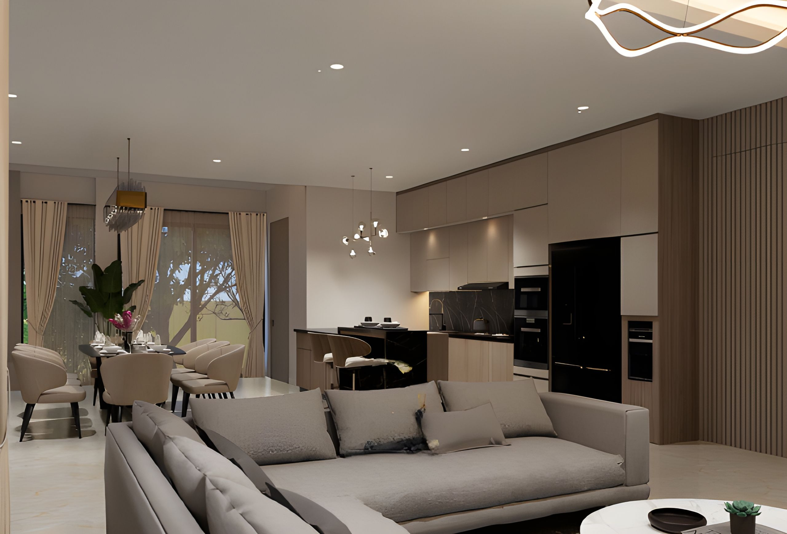
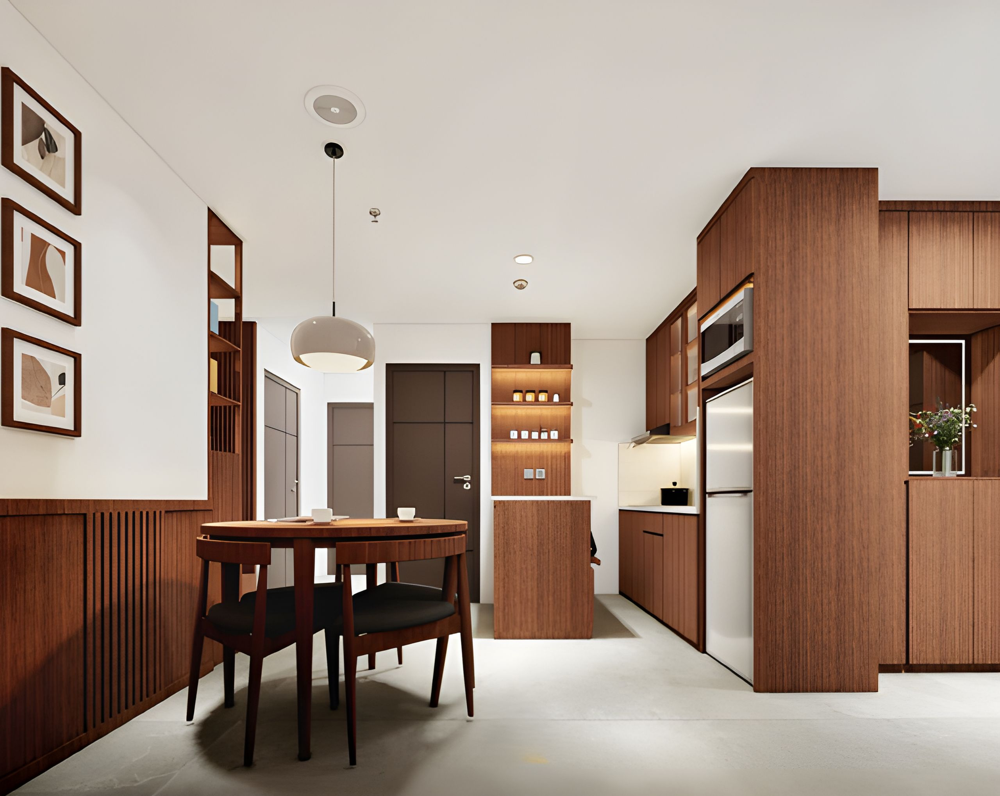
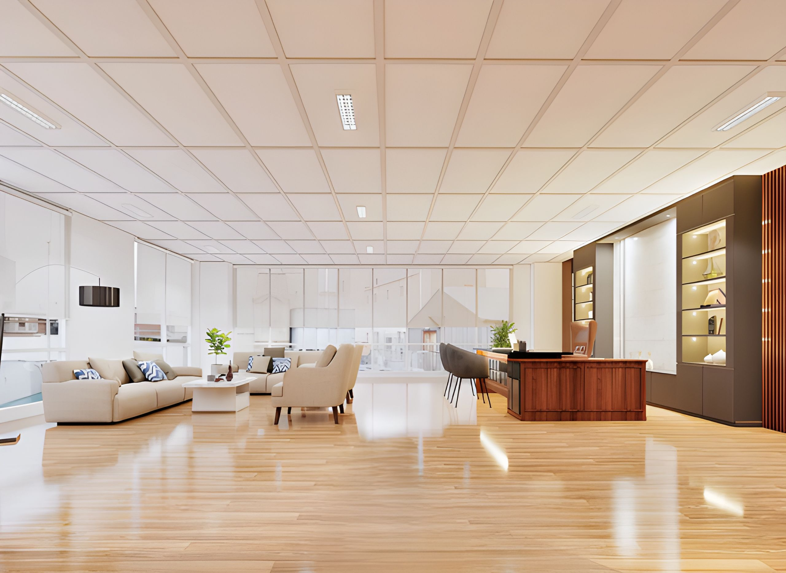
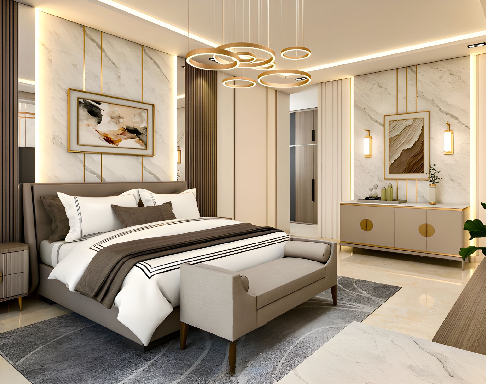

# 🏠 Desain Interior Web

**Aplikasi web manajemen jasa desain interior berbasis Laravel** — menampilkan portofolio proyek, pemesanan layanan, pembayaran online, dan panel admin lengkap.

[](https://laravel.com)
[](https://php.net)
[](https://mysql.com)
[](https://tailwindcss.com)
[](https://docker.com)

---

## 🖼️ Tampilan Web

### Landing Page — Hero Section


### Portfolio Proyek — Ruang Makan & Dapur


### Portfolio Proyek — Office & Workspace
<table>
  <tr>
    <td></td>
    <td></td>
  </tr>
  <tr>
    <td align="center"><em>Desain Office / Ruang Kerja</em></td>
    <td align="center"><em>Kamar Tidur Luxury</em></td>
  </tr>
</table>

---

## ✨ Fitur Utama

### 🌐 Halaman Publik (Frontend)
- **Hero Carousel** — Slideshow gambar interior premium dengan animasi AOS
- **Portfolio / Galeri Proyek** — Tampilkan karya desain dengan filter kategori
- **Layanan** — Detail 5 layanan desain yang tersedia
- **FAQ Accordion** — Pertanyaan yang sering diajukan
- **Halaman Harga** — Paket layanan dengan harga transparan
- **Formulir Kontak** — Kirim pesan langsung via email
- **About Us** — Profil perusahaan dan tim desainer

### 🔐 Sistem Autentikasi
- Register, Login, Lupa Password, Verifikasi Email
- Role-based access: **Admin** & **User**

### 👤 Dashboard User
- Buat & lacak pesanan desain interior
- Upload foto referensi
- Pembayaran online via **Midtrans** (Credit Card, GoPay, dll.)
- Riwayat transaksi & status pesanan real-time
- Notifikasi push via **Firebase Cloud Messaging (FCM)**

### 🛠️ Panel Admin
- **Dashboard** — Statistik pesanan, revenue, dan performa tim
- **Manajemen Proyek** — CRUD portfolio dengan multiple images
- **Manajemen Pesanan** — Update status, jadwal, dan timeline foto
- **Manajemen Tim** — Data desainer dan performa kerja
- **Analytics** — Risk analysis & team performance chart
- **Laporan** — Export data pesanan ke Excel & PDF
- **Pengaturan Situs** — Edit konten landing page secara dinamis
- **Manajemen Admin & User** — CRUD akun pengguna

---

## 🛠️ Tech Stack

| Komponen | Teknologi |
|---|---|
| Backend Framework | Laravel 11 |
| Template Engine | Blade + Bootstrap 5 |
| CSS Framework | Tailwind CSS + SCSS |
| Database | MySQL 8.0 |
| Build Tool | Vite |
| Payment Gateway | Midtrans |
| Push Notification | Firebase Cloud Messaging |
| PDF Generator | DomPDF |
| Excel Export | Laravel Excel (Maatwebsite) |
| Real-time | Laravel Echo + Pusher |
| Container | Docker + Nginx |
| Animation | AOS (Animate On Scroll) |

---

## 🚀 Menjalankan Secara Lokal

### Prasyarat
- PHP >= 8.2
- Composer
- Node.js >= 18
- MySQL 8.0

### Langkah Instalasi

```bash
# 1. Clone repository
git clone https://github.com/WagYu31/desain-interior-web.git
cd desain-interior-web

# 2. Install dependencies
composer install
npm install

# 3. Buat file .env
cp .env.example .env
php artisan key:generate

# 4. Konfigurasi database di .env
# DB_DATABASE=desaininterior
# DB_USERNAME=root
# DB_PASSWORD=

# 5. Jalankan migrasi & seeder
php artisan migrate --seed

# 6. Link storage
php artisan storage:link

# 7. Build asset
npm run dev

# 8. Jalankan server
php artisan serve
```

Akses di: **http://localhost:8000**

---

## 🐳 Menjalankan dengan Docker

```bash
# Copy env khusus Docker
cp .env.example .env

# Build & jalankan container
docker compose up -d --build

# Jalankan migrasi di dalam container
docker compose exec app php artisan migrate --seed
docker compose exec app php artisan storage:link
```

Akses di: **http://localhost:8080**

> Lihat [`docker-setup.sh`](docker-setup.sh) untuk setup otomatis lengkap.

---

## 🔑 Akun Default (Setelah Seeder)

| Role | Email | Password |
|---|---|---|
| Admin | admin@desaininterior.com | password |
| User | user@desaininterior.com | password |

---

## 📁 Struktur Direktori

```
desain-interior-web/
├── app/
│   ├── Http/Controllers/
│   │   ├── Admin/          # Controller panel admin
│   │   └── Auth/           # Autentikasi
│   ├── Models/             # Eloquent models
│   └── Events/             # Real-time events
├── resources/
│   ├── views/
│   │   ├── admin/          # Blade views admin
│   │   ├── frontend/       # Halaman publik
│   │   └── user/           # Dashboard user
│   └── images/             # Aset gambar
├── docker/                 # Konfigurasi Docker & Nginx
├── docs/
│   └── screenshots/        # Screenshot tampilan web
└── database/
    ├── migrations/
    └── seeders/
```

---

## 📄 Lisensi

Project ini dibuat untuk keperluan pengembangan aplikasi jasa desain interior.

---

<p align="center">
  Dibuat dengan ❤️ menggunakan <a href="https://laravel.com">Laravel</a>
</p>
